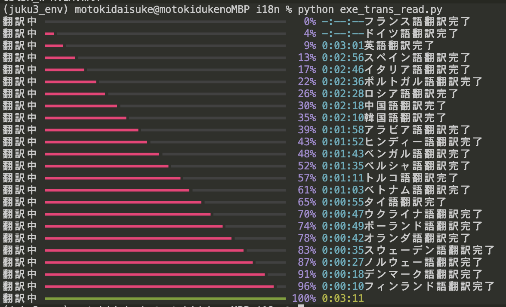

# Monikielinen käännös i18niwatoko

i18niwatoko on tekoälytyökalu, joka kääntää kaikkia maailman kieliä äidinkielestä toiseen.
Tässä olevat ohjelmatiedostot on kirjoitettu vain äidinkielillä, eikä niissä ole lainkaan korkeamman tason ohjelmointikieliä. Tämä on täysin uusi ohjelmatiedostojen joukko.




## i18niwatoko:n filosofia

Tavoitteena on maailma, jossa kaikki voivat nauttia ohjelmoinnista kielimuurien yli.

i18niwatoko on syntynyt ratkaisemaan monikielisen käännöksen haasteita. Perinteisissä monikielisissä käännöstyökaluissa on ollut ongelmana, että ne perustuvat englanninkielisiin ohjelmointikieliin, mikä on asettanut suuren esteen ei-englanninkielisille.

i18niwatoko on kuitenkin erilainen. Se on luonnollisella kielellä toimiva ohjelmointikieli, jolla kaikki voivat kirjoittaa ohjelmia äidinkielellään. Lisäksi i18niwatokossa on toiminto, joka kääntää automaattisesti japaninkieliset viestit useille eri kielille. Tämä poistaa tarpeen käännöstyöltä käsin ja mahdollistaa tehokkaan monikielisen toteutuksen.

Ohjelmointi ei ole vain tiettyjen lahjakkaiden ihmisten etuoikeus. Poistamalla kielimuurit, i18niwatoko haluaa mahdollistaa, että kaikki ihmiset ympäri maailmaa voivat kokea ohjelmoinnin ilon ja mahdollisuudet.

Yhdessä i18niwatoko:n kanssa voimme kunnioittaa kielellisen moninaisuuden arvoa ja toteuttaa yhteiskunnan, jossa ihmiset ympäri maailmaa voivat käyttää luovuuttaan ja synnyttää uusia ideoita ohjelmoinnin kautta.

## Tarvittavat komponentit

- Python 3.x
- niwatoko-kirjasto
- GCP Vertex AI
- Anthropic Claude API
- OpenAI API

## Asennus

1. Asenna niwatoko-kirjasto.

   ```
   pip install --upgrade niwatoko
   ```

2. Määritä OpenAI, Anthropic ja GCP Vertex AI -asetukset.

   ```
   # Aseta OpenAI API-avain
   # https://platform.openai.com/api-keys
   export OPENAI_API_KEY=your_openai_api_key
   
   # Aseta Anthropic API-avain
   # https://console.anthropic.com/settings/keys
   export ANTHROPIC_API_KEY=your_anthropic_api_key
   
   # Määritä GCP Vertex AI
   # Hanki GCP Vertex AI -projektin ID ja sijainti. (Jos unohdat, ota yhteyttä Motoki X:ään https://x.com/ai_syacho)
   export GEMINI_PROJECT=your_gcp_project_id
   export GEMINI_LOCATION=asia-northeast1
   ```

## Käyttö

1. Valmistele käännösmääritystiedosto (`def_translation.md`).

2. Suorita seuraava komento käännöksen aloittamiseksi.
   *gemini-1.5-flash on vakaa, mutta luonnollisen kielen oh