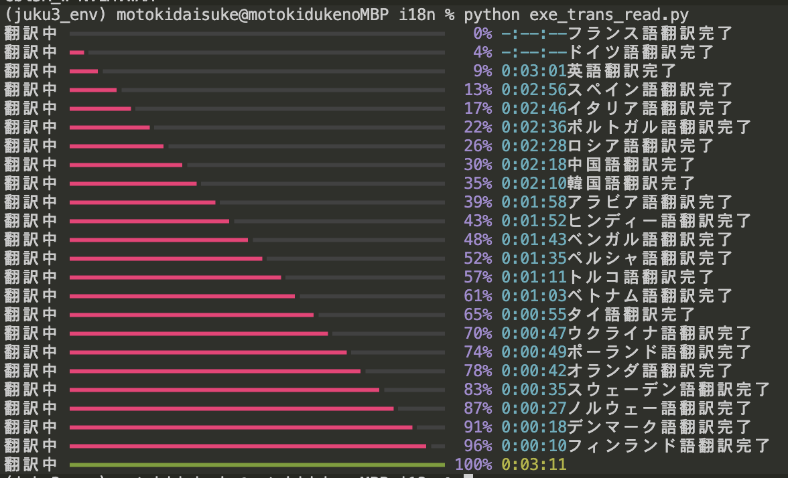

# ภาษาหลายภาษา i18niwatoko

i18niwatoko คือเครื่องมือ AI ที่สามารถแปลภาษาแม่ของแต่ละคนไปยังภาษาต่างๆ ทั่วโลกได้ทั้งหมด
และโปรแกรมไฟล์ที่อยู่ในที่นี้ได้เขียนด้วยภาษาแม่ของแต่ละคนเท่านั้น ไม่มีภาษาระดับสูงใดๆ เลย เป็นไฟล์โปรแกรมใหม่ล่าสุด

## แนวคิดของ i18niwatoko

มุ่งสู่โลกที่ทุกคนสามารถเพลิดเพลินกับการเขียนโปรแกรมได้ โดยข้ามพ้นข้อจำกัดด้านภาษา

i18niwatoko เกิดขึ้นเพื่อรับมือกับความท้าทายของการแปลภาษาหลายภาษา ในเครื่องมือแปลภาษาหลายภาษาแบบเดิม จำเป็นต้องใช้ภาษาโปรแกรมที่ใช้ภาษาอังกฤษเป็นฐาน ซึ่งเป็นอุปสรรคสำหรับผู้ที่ไม่ใช่เจ้าของภาษาอังกฤษ

อย่างไรก็ตาม i18niwatoko แตกต่าง เป็นภาษาโปรแกรมที่สามารถใช้ภาษาธรรมชาติในการขับเคลื่อนระบบ ทำให้ทุกคนสามารถเขียนโปรแกรมด้วยภาษาแม่ของตนเองได้ นอกจากนี้ i18niwatoko ยังมีฟังก์ชันในการแปลไฟล์ข้อความภาษาญี่ปุ่นไปยังหลายภาษาโดยอัตโนมัติ ซึ่งช่วยให้ไม่จำเป็นต้องแปลด้วยมือ และสามารถจัดการการรองรับหลายภาษาได้อย่างมีประสิทธิภาพ

การเขียนโปรแกรมไม่ใช่สิ่งที่เฉพาะเจาะจงสำหรับผู้ที่มีความสามารถพิเศษเท่านั้น การกำจัดข้อจำกัดด้านภาษา จะทำให้ทุกคนทั่วโลกสามารถสัมผัสกับความสนุกสนานและศักยภาพของการเขียนโปรแกรม นั่นคือแนวคิดอันสูงส่งของ i18niwatoko

ร่วมกับ i18niwatoko เพื่อสร้างสังคมที่เคารพความหลากหลายทางภาษา และ